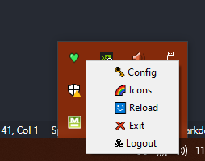
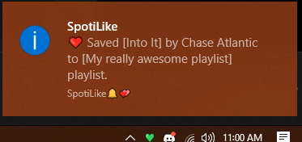
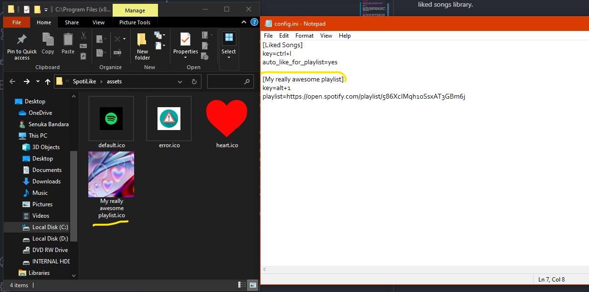

<!-- 

[Click Me]: https://www.mediafire.com/file/xqdh8t7zxfdlonr/SpotiLike_Setup.rar/file

Hello. 👋

This simple script would allow you to save your songs to your playlists/liked songs library while you're listening to them on-the-go with a custom hotkey.

### Why?

I'm a really music loving person and I had the need to save songs while I'm listening to them. Mostly into my _liked songs_ library but also into a few playlists sometimes.

I personally found it annoying to stop what I was doing at the moment(_specially when I'm gaming_) and return to the Spotify application to find the playlist I wanna save the song to (_from my huge list of playlists_) and click save from the drop down. So, I wanted a solution to save my songs using my keyboard.

Yea you get the point.

___

# Download
You can download SpotiLike through MediaFire here:
Will be coming soon :(

# Features

* Custom hotkeys.
* Custom Icons to appear in the nofitication.
* Custom Playlist names to appear in the notification.
* Avoids duplicate saves in playlists. (What?)
    - Spotify attempts to make duplicates of the same song in a playlist by default if, you attempt to save a song that already exists in the target playlist. `SpotiLike` would show you a notif if this happens saying it's already saved (you'll see)
* Auto-add to your liked songs library upon saving a song to a playlist. This is a feature that can be either enabled or disabled.

# Setup and Configuration.

The `setup.exe` file has a pretty straight forward installation process. Basically, you'd install the app like you install any other application. This might take a few minutes depending on how occupied your system is.

## After Installation, now what?

You will be redirected to a Spotify.com authorization page. Once you have authorized your Spotify account, the app will minimize itself to the System Tray.

Like this:



Right-clicking the icon would show you this menu.

### Configuration file. 🗝


Clicking config would open a `config.ini` file in your preferred text editor (most likely notepad).

The config file should probably look like below:

```ini
[Liked Songs]
key=ctrl+l
auto_like_for_playlist=yes

# Good Luck!
```

Each entry inside `[]` would count as a playlist.

After you define your playlist inside `[]` put two values below it namely, 
 - key - *hotkey*
 - playlist - *playlist url*

Have a look at this example:
```ini
[Liked Songs]
key=ctrl+l
auto_like_for_playlist=yes

[My really awesome playlist]
key=alt+1
playlist=https://open.spotify.com/playlist/586XcIMqh10SsxAT3GBm6j

[Second cool playlist]
key=alt+2
playlist=https://open.spotify.com/playlist/1923kljlkadsnlcasdlad

[Wait another PLaylist?]
key=ctrl+shift+f
playlist=https://open.spotify.com/playlist/01HZ3A9NxKJNcKg6BPNOR6
```

When you save the config file, the app would auto reload itself.

All you gotta do is press the hotkeys now and it's gonna show a notification to notify you that the song succesfully saved.



**NOTE**: The `auto_like_for_playlist` is "yes" by default. You can change it to "no" if you don't want songs auto added to your liked songs library.


### Icons 🌈

Yea, I said about custom icons too huh.

The default icon is a super ugly ℹ icon :/ You can have a custom icon per playlist you create in your `config.ini`.

NOTE: You should have your image as a `.ico` file. You can find plenty of sites online that converts your image file for you.

In the Tray menu, go ahead and click the `Icons 🌈` option. This will open a folder which by default contains 3 icon files. 
* Grab your .ico file and copy it to the folder.
* Rename it to the name you defined your playlist in the config file. (Example; if you did `My Awesome Playlist` the .ico file name should be `My Awesome Playlist` too.)

Assuming what I just said made sense:



Yeah, just like that.

### **For extra clarification:**

Here's me adding a test playlist I created to the config file, saving it, and doing the hotkey. Yes, it works like expected. 


**Wait, can I make this open on startup somehow?**

Yes. Follow these steps below:
- Hold windows key + R
- In the Run dialog that appears, type `shell:startup`.
- Paste the SpotiLike shortcut in the folder that appears. 
# Congratulations you made it to the end.

## Say Hi?

Add me on Discord! `Yeti#2222`

This project was mostly based on my personal need. It probably might be useless for alot of people, but if you find it useful however feel free to install it and send me a virtual hug.

Thanks.

___
(_huh what's that `SpotiLike 2.0` folder doing in the repo? nevermind about it. I attempted to create a gui version of this but I abandoned it because-_) -->

# SpotiLike 💚

## About

Save Spotify songs on-the-go while you're listening, to your Liked Songs library or your favorite playlists with custom keyboard shortcuts.

You can find instructions [here](https://yeti2006.github.io/SpotiLike.html)